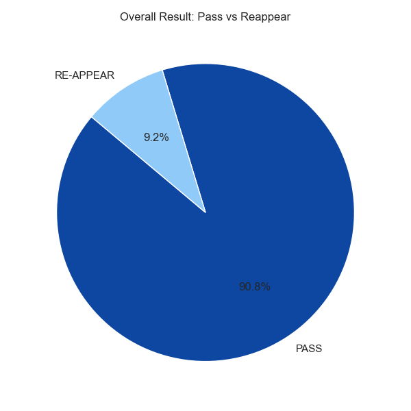
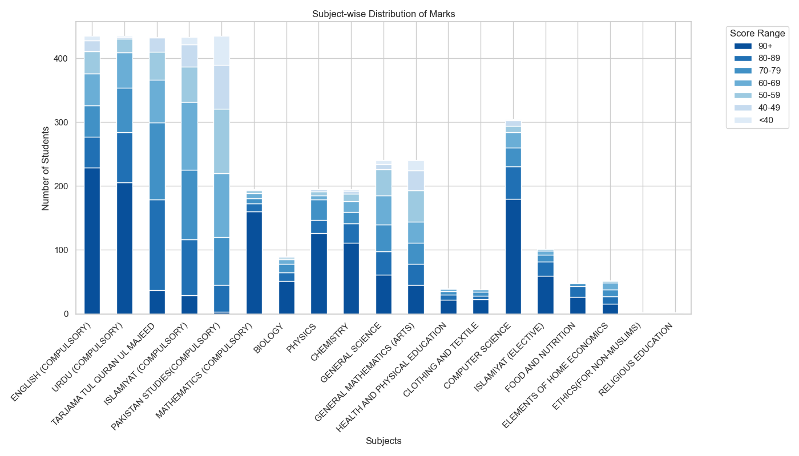
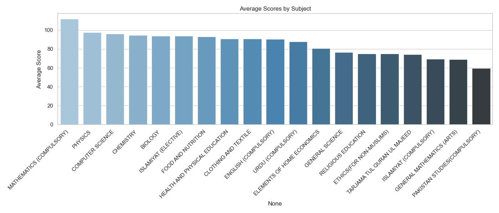
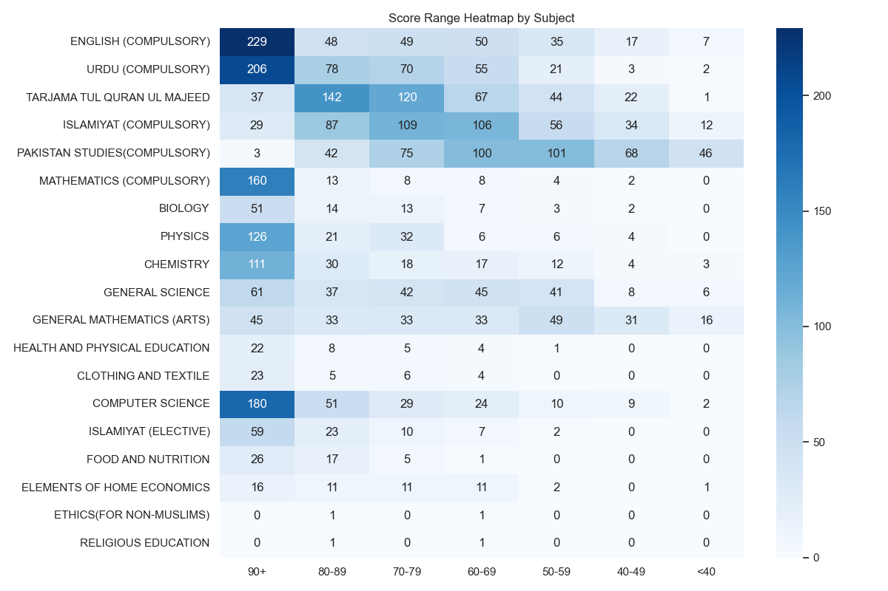

# Examination Report Summary

This report presents an analysis of the students' results, focusing on subject-wise performance, overall pass/reappear rates, and other key visual insights.

---

## 📊 Pass vs Reappear

- **Pass**: 395 students  
- **Reappear**: 40 students  
- **Pass Percentage**: 90.8%  
- **Reappear Percentage**: 9.2%

---

## 📚 Subject-wise Score Distribution

The chart below shows how many students scored in various score ranges for each subject.

---

## 📈 Average Scores by Subject

This chart presents the average score achieved in each subject across all students.

---

## 🔥 Heatmap of Score Distribution

This heatmap provides a tabular view of how students performed across score brackets for each subject.

---

### 📝 Key Insights

- Subjects like **General Science** and **Education** have higher average scores.
- A few subjects have more students scoring below 40, indicating difficulty or low performance.
- Overall, **90.8%** of students passed while **9.2%** need to reappear.
